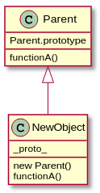

# <div align="center"> The constructor Pattern </div>


&nbsp;

* <p> Dans les langages de programmation orientés objet classiques, un constructeur est une méthode spéciale utilisée pour initialiser un objet nouvellement créé une fois que la mémoire lui a été allouée. En JavaScript, presque tout est un objet, nous nous sommes le plus souvent intéressés aux constructeurs d'objets. Étant donné que les constructeurs d'objets sont utilisés pour créer des types d'objets spécifiques, par exemple, à la fois pour préparer l'objet à utiliser et pour accepter les arguments qu'un constructeur peut utiliser pour définir les valeurs des propriétés et des méthodes des membres lors de la création initiale de l'objet. </p>




&nbsp;

* <p> Comme nous l'avons vu, JavaScript ne prend pas en charge le concept de classes, donc à l'intérieur d'un constructeur, le mot-clé this fait référence au nouvel objet qui est créé en revisitant la création d'objet, un constructeur de base peut ressembler à ceci: </p>

```javascript
function Car(model, year, miles) {
  this.model = model;
  this.year = year;
  this.miles = miles;
}

// Usage:
var bmw = new Car('M4', '2019', '1000');
 ```