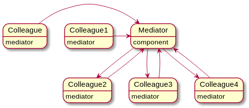

# <div align="center"> The Mediator Pattern </div>



* S'il apparaît, un système a trop de relations directes entre les composants. il est peut-être temps d'avoir un point central du contrôle par lequel les composants communiquent à la place. Le modèle de médiateur favorise un couplage lâche en garantissant qu'au lieu de composants se référant explicitement les uns aux autres.

```javascript
var mediator = (function() {
  var topics = {};
  var subscribe = function(topic, fn) {
    if (!topics[topic]) {
      topics[topic] = [];
    }
    topics[topic].push({ context: this, callback: fn });
    return this;
  };

  // publish/broadcast an event to the rest of the application
  var publish = function(topic) {
    var args;
    if (!topics[topic]) {
      return false;
    }
    args = Array.prototype.slice.call(arguments, 1);
    for (var i = 0, l = topics[topic].length; i < l; i++) {
      var subscription = topics[topic][i];
      subscription.callback.apply(subscription.content, args);
    }
    return this;
  };
  return {
    publish: publish,
    subscribe: subscribe,
    installTo: function(obj) {
      obj.subscribe = subscribe;
      obj.publish = publish;
    }
  };
})();
```