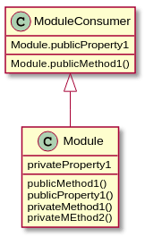

# <div align='center'>  The module Pattern </div>

### <p> Les modules font partie intégrante de l'architecture de toute application robuste et aident généralement à garder l'unité de code d'un projet parfaitement séparée et organisée.
#### Il existe plusieurs options pour implémenter des modules. Ceux-ci inclus:

- Notation littérale d'objet
- Le modèle de module
- Modules AMD
- Module CommonJS
- Modules ECMAScript Harmony


&nbsp;
</p>

### Le modele des modules:



### Objets littéraux: 

```javascript
var newObject = {
  variableKey: variableValue,
  functionKey: function() {
    //…
  }
};
```

## <div align='center'> The Revealing Module Pattern </div>

* Une chose que le module révélateur peut faire est d'éviter de répéter le nom de l'objet principal lorsque nous voulons appeler une méthode publique à partir d'une autre ou accéder à des variables publiques.

```php
var myRevealingModule = (function() {
  var privateVariable = 'not okay',
    publicVariable = 'okay';
  function privateFun() {
    return privateVariable;
  }

  function publicSetName(strName) {
    privateVariable = strName;
  }

  function publicGetName() {
    privateFun();
  }

  return {
    setName: publicSetName,
    message: publicVariable,
    getName: publicGetName
  };
})();

//Usage:

myRevealingModule.setName('Marvin King');
```